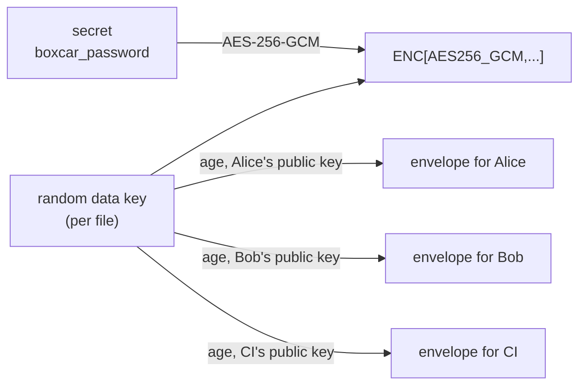

# How SOPS and age protect the bundle password

The `tls.box` bundle is encrypted with a password. In
[`examples/sops-combined`](../examples/sops-combined/README.md) that password
is generated, never typed, and stored in a SOPS-encrypted file that each
operator opens with their **own** age key. This page explains how that works,
what rotation means, and why the file is safe to commit.

## Two tools, two jobs

- **age** encrypts to a key *pair*. The **public key** (`age1...`) can be shared
  freely. The **private key** (`AGE-SECRET-KEY-...`) never leaves its owner.
  Anyone can lock something to your public key; only your private key opens it.
- **SOPS** encrypts the *values* in a YAML file, leaves the keys (structure)
  readable, and uses age to decide who may decrypt.

> Think of a mailbox: the public key is the mail slot, anyone can post a
> letter. The private key is the only key that opens the box.

## What happens when you encrypt

SOPS does not lock the secret once per person. It locks the secret once, then
locks the *key to that lock* once per person.



1. You have a secret (the generated bundle password).
2. SOPS makes a random 256-bit **data key** just for this file.
3. The data key encrypts each value (AES-256-GCM). Values become `ENC[...]`.
4. The data key is encrypted once per public key listed in `.sops.yaml` (an
   "envelope"), and the plain data key is discarded.

To read the file, SOPS finds *your* envelope, opens it with your private key to
recover the data key, and decrypts the values. Envelopes are independent, so
adding or removing one person never touches anyone else's key.

## Multiple operators, each with their own key

Nobody shares a private key. Each person or CI job runs this once, on their own
machine:

```bash
age-keygen -o ~/.config/sops/age/keys.txt
# Public key: age1ql3z...c8p      <- send only this line
```

The repo maintainer adds the public keys to `.sops.yaml`:

```yaml
creation_rules:
  - path_regex: files/.*\.sops\.yaml$
    age: >-
      age1ql3z...c8p,
      age1x5d8...k2w,
      age1v0ne...9ra
```

On deploy each person points SOPS at their own private key:

```bash
export SOPS_AGE_KEY_FILE=~/.config/sops/age/keys.txt
ansible-playbook -i inventory.ini deploy.yml
```

`deploy.yml` reads the password with `lookup('community.sops.sops', ...)` and
passes it to `sanjaynagpal.boxcar.unbox`. A CI job's private key belongs in
that CI system's secret store.

## Rotation: two different things

| You want to... | What changes | How |
|---|---|---|
| Add a person | A new envelope is added. Secret and data key unchanged. | Edit `.sops.yaml`, `sops updatekeys FILE` |
| Replace a person's key (new laptop, leaked key) | Remove the old public key, add the new one. | Edit `.sops.yaml`, `sops updatekeys FILE` |
| Remove a person | Their envelope is dropped going forward. **Their old copies still work.** | `sops updatekeys FILE`, then rotate the password |
| Change the data key | New data key, values re-encrypted, same password inside. | `sops rotate -i FILE` |
| Change the password itself | New bundle password, re-sealed bundle, re-encrypted SOPS file. | Steps below |

### Why removal is not enough

Removing Bob from `.sops.yaml` does not take back what he already has. His
private key still opens his envelope in any older version of the file, and Git
keeps every old version. After removing someone, **change the secret the
envelope protected**. If their TLS private key was in the bundle, also issue a
new certificate and key, since they could have copied the files while they had
access.

### Rotating the bundle password

Commit both files together; a new bundle with the old password file fails
closed.

```bash
OLD="$(sops -d --extract '["boxcar_password"]' files/bundle-password.sops.yaml)"
BOXCAR_PASSWORD="$OLD" ../../tools/ansible-boxcar unbox files/tls.box ./work   # protected folder
NEW="$(../../tools/ansible-boxcar seal files/tls.box ./work --force --generate)"
printf 'boxcar_password: "%s"\n' "$NEW" |
  sops --encrypt --filename-override files/bundle-password.sops.yaml \
       --input-type yaml --output-type yaml /dev/stdin > files/bundle-password.sops.yaml
unset OLD NEW; rm -rf ./work
git add files/tls.box files/bundle-password.sops.yaml && git commit
```

## Why this is safe to commit

The file in Git looks like this: names readable, values not.

```yaml
boxcar_password: ENC[AES256_GCM,data:9fWb3Qx1...,iv:...,tag:...,type:str]
sops:
  age:
    - recipient: age1ql3z...c8p
      enc: |
        -----BEGIN AGE ENCRYPTED FILE-----
        YWdlLWVuY3J5cHRpb24ub3JnL3YxCi0+IFgyNTUxOSB...
        -----END AGE ENCRYPTED FILE-----
    - recipient: age1x5d8...k2w
      enc: |  ...
  mac: ENC[AES256_GCM,data:...]
  version: 3.13.3
```

**Why it holds up**

- The password is AES-256 encrypted; without the data key it is noise.
- The data key exists only inside age envelopes, one per recipient.
- `age1...` public keys are meant to be public.
- The `mac` detects tampering with values or recipients.
- `tls.box` is separately encrypted by boxcar, so one leaked file alone gives
  nothing.

**What it does not protect**

- **Private keys.** Never commit `keys.txt`. This is the one thing that must
  stay out of Git.
- **Metadata.** Key names and the number of recipients are visible.
- **History.** Old versions stay readable by former recipients (hence rotating
  after a removal).
- **A compromised recipient.** Anyone holding any listed private key can read
  the file.

The safety rests on one separation: the locked file travels everywhere; the
private keys never leave their owners.

## Debugging

`deploy.yml` uses `no_log: true`, which hides why a task failed. Test the SOPS
step directly:

```bash
sops -d files/bundle-password.sops.yaml
```

If that fails, your key is not a recipient. If it works but `unbox` reports
"incorrect password or corrupted bundle", the bundle and the password file come
from different seals.
